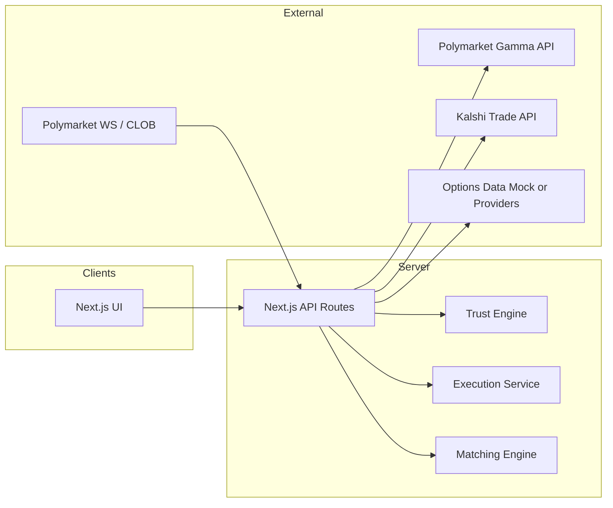
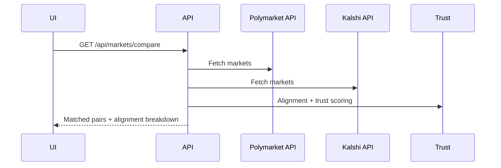

# PM Arbitrage — Architecture & Dataflow

## 1. System Architecture (High‑Level)

## 2. Component Overview
- **Next.js UI**: Markets, Compare, Arbitrage, Terminal, Trust Center, Options IV, Portfolio, Bot.
- **API Routes**: Data aggregation, streaming, matching, trust scoring, execution simulation.
- **Trust Engine**: Resolution criteria extraction + evidence scoring.
- **Execution Service**: Paper‑trade quotes, submit, cancel, audit log.
- **Matching Engine**: Semantic + text similarity with strict alignment filters.

---

## 3. Dataflow Appendix

### 3.1 Market Discovery Flow
1. UI requests `/api/markets` and `/api/kalshi/markets`.
2. API normalizes raw data into shared schema.
3. UI merges into a unified market list.

### 3.2 Compare & Matching Flow
1. UI requests `/api/markets/compare`.
2. API:
   - Loads Polymarket + Kalshi markets.
   - Runs **semantic/text matching**.
   - Applies **resolution alignment** and mismatch penalties.
3. UI renders compare cards + alignment breakdown.

### 3.3 Trust Analysis Flow
1. UI requests `/api/trust/summary`.
2. API computes trust scores and returns summary.
3. Selecting a market triggers `/api/trust/market` for deep analysis.

### 3.4 Arbitrage Scan Flow
1. UI requests `/api/arbitrage/scan`.
2. API runs match engine and computes arbitrage opportunities.
3. UI displays results; execute modal fetches quotes.

### 3.5 Execution Flow (Paper‑Trade)
1. UI requests `/api/execution/quote`.
2. API applies risk checks and returns quote.
3. UI submits `/api/execution/submit`.
4. Execution record is stored and status updated asynchronously.

### 3.6 Options IV Flow
1. UI loads mock options data.
2. Black‑Scholes calculator derives implied probabilities.
3. UI compares prediction price vs options probability.

---

## 4. Sequence Diagram (Compare)

